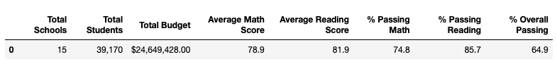
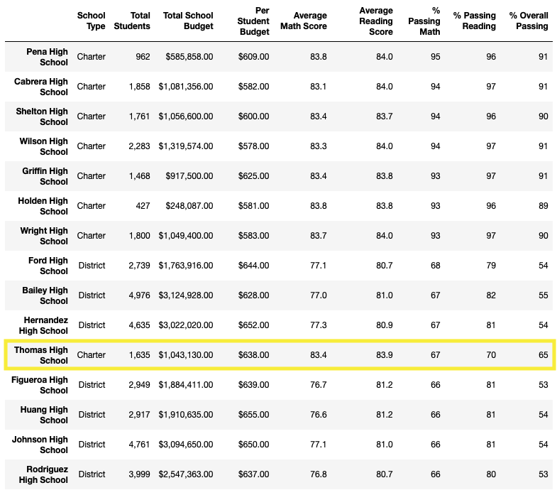
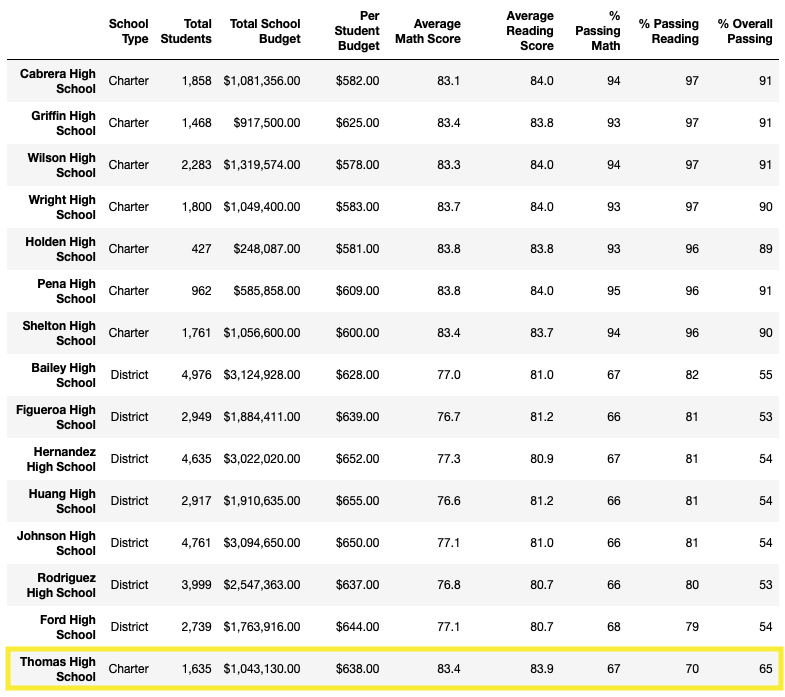
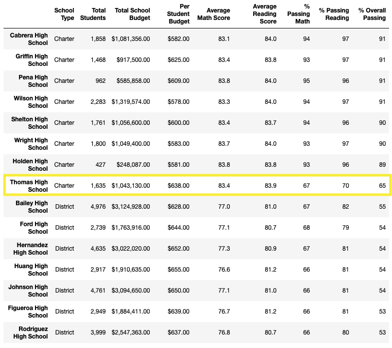

# School_District_Analysis

## Overview
The school board has notified Maria and her supervisor that the original student data file shows evidence of acedemic dishonesty for the ninth grade students at Thomas High School. To uphold state-testing standards, we are replacing the math and reading scores for Thomas High School 9th-graders with NaN while keeping the rest of hte data intact. The school district analysis will be run again with the modified data.

## Results
- After removing the test scores for the ninth grade students at Thomas High, the district's Average Math Score, % Passing Math, % Passing Reading, and % Overall Passing all went down by less than half a percent.
  - <b>Original District Summary</b>
  
  - <b>Cleaned District Summary</b>

- After removing Thomas High School's ninth grade test scores, Thomas High School dropped in the School Summary when sorted by % Passing Math (6th to 11th), % Passing Reading (3rd to 15th/last), and % Overall Passing (4th to 8th).
  - <b>Original School Summary Sorted by % Passing Math</b>

  - <b>Cleaned School Summary Sorted by % Passing Math</b>

  - <b>Original School Summary Sorted by % Passing Reading</b>

  - <b>Cleaned School Summary Sorted by % Passing Reading</b>

  - <b>Original School Summary Sorted by % Overall Passing</b>

  - <b>Cleaned School Summary Sorted by % Overall Passing</b>

- After removing Thomas High School's ninth grade test scores, the only difference when grouping by grade is Thomas High School 9th grade averages are listed as NaN.
  - <b>Original Math Scores By Grade</b>
  
  - <b>Cleaned Math Scores By Grade</b>
  
  - <b>Original Reading Scores By Grade</b>
  
  - <b>Cleaned Reading Scores By Grade</b>
  
- After removing the Thomas High School 9th grade student scores and only using Thomas grades 10-12 to run the spending, school size, and school type analyses, there were no changes to the outcomes.
  - <b> Average Scores By Spending Ranges Per Student </b>
  
  - <b> Average Scores By School Size </b>
  
   - <b> Average Scores By School Type </b>
  

## Summary
Replacing the Thomas High School 9th grade student test scores with NaN significantly dropped their standing when sorting the school by % Passing Math, % Passing Reading, and % Overall Passing. However, once the data was further modified to only use the 10th, 11th, and 12th grade students as part of the data anaylsis, the results were the same as in the module for Average Scores by Spend Range per Student, Average Scores by School Size, and Average Scores by School Type.